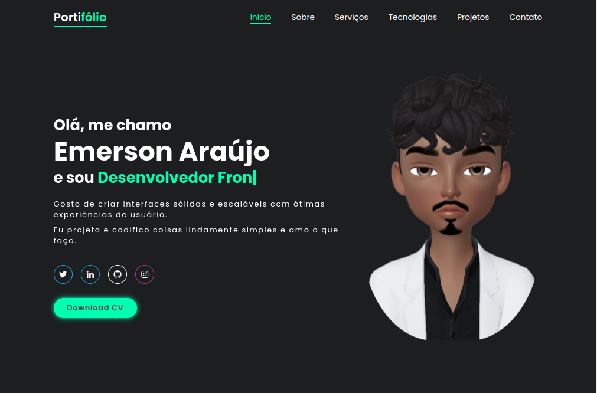

<h1 align="center">
  💻 Portfólio - Emerson Araújo
</h1>

<h4 align="center"><a href="https://portifolio-emerson-araujo.vercel.app/" target="_blank">Clique para visitar o portifólio</a></h4>

## 📚 Seções

O site é composto por quatro seções:

- **Apresentação:** Nele temos uma breve apresentação;
- **Sobre:** Nessa seção tenho uma descrição dizendo um pouco sobre quem sou;
- **Serviços:** Informa minha atual função no mundo do desenvolvimento de software;
- **Projetos:** Apresenta alguns projetos desenvolvidos e com link direto para os respectivos códigos no GitHub;
- **Tecnologias:** Nele apresentamos meus conhecimentos em algumas linguagens com foco no front-end;

---

## 💼 Tecnologias utilizadas

Para o desenvolvimento deste site utilizei as seguintes tecnologias:

- HTML;
- CSS;
- JavaScript;

---

<h2>🦄 Autor</h2>

<table>
  <tr>
    <td align="center">
      <a href="https://github.com/EmersonAraujonb">
         
        
          <b>Emerson Araújo</b>
        
      </a>
    </td>
  </tr>
</table>
